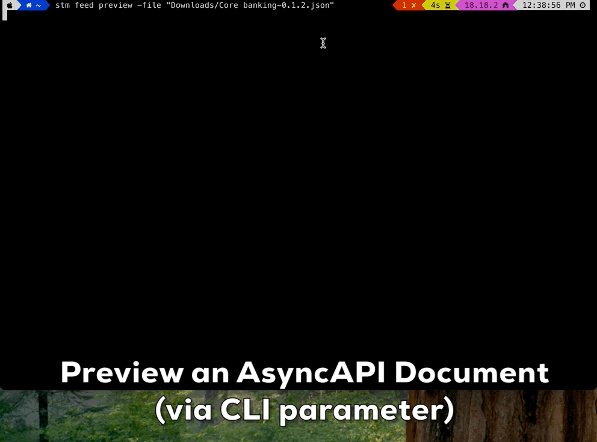
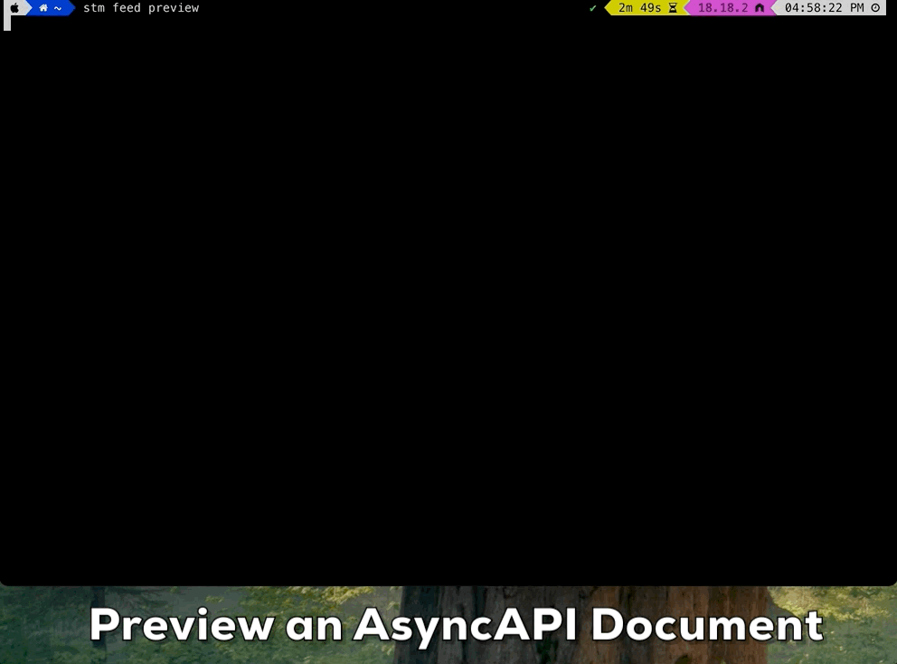
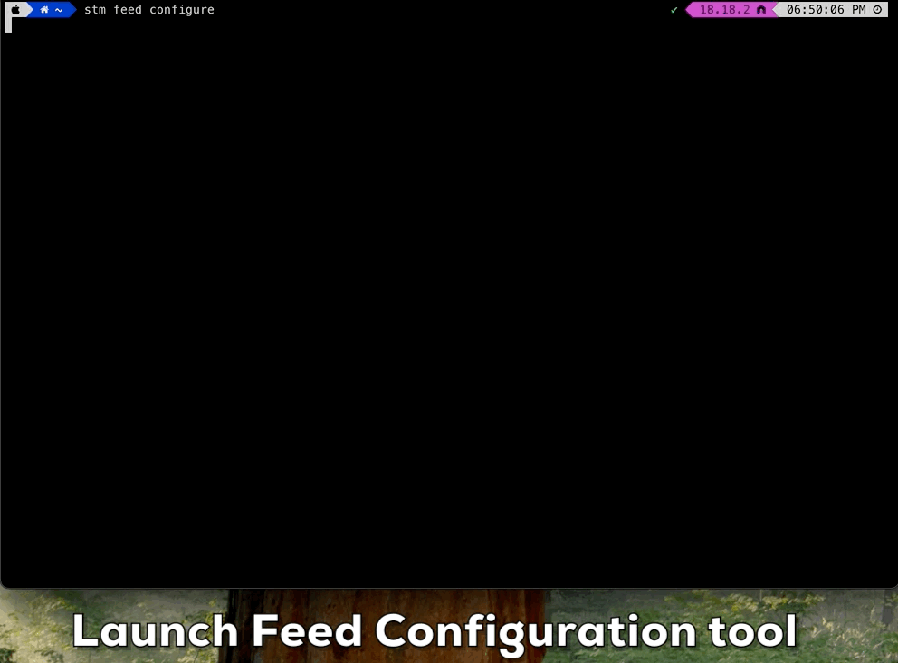
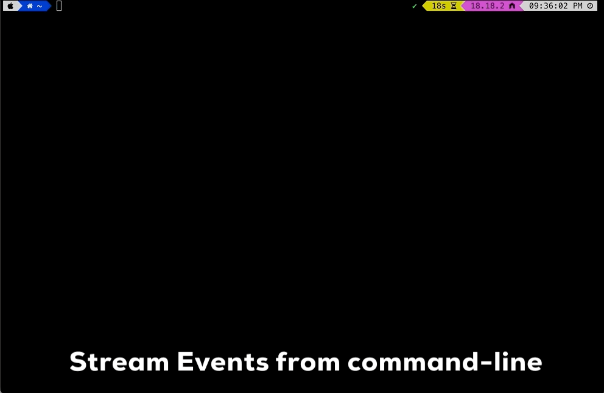
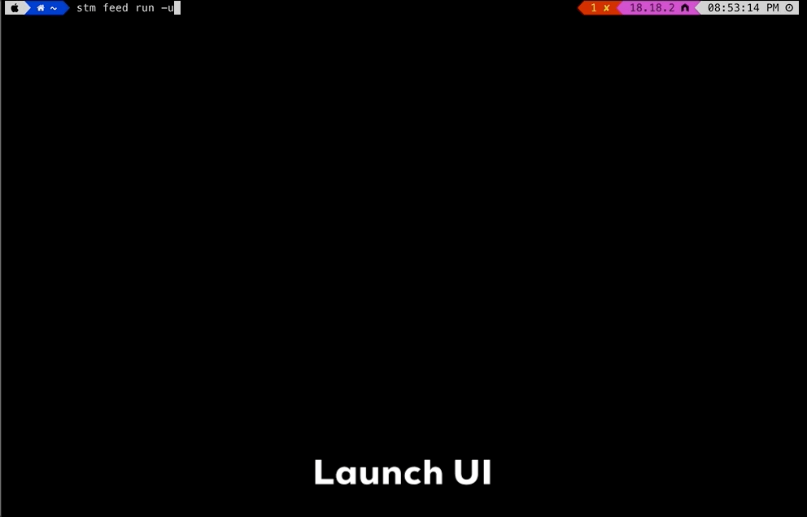
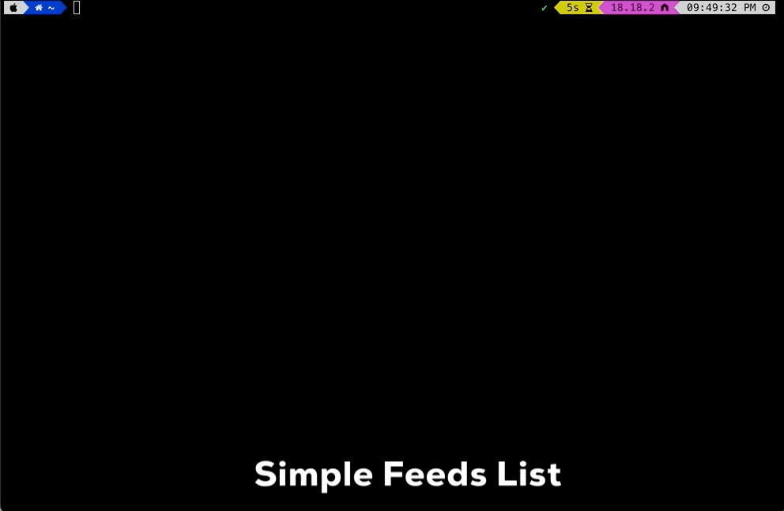
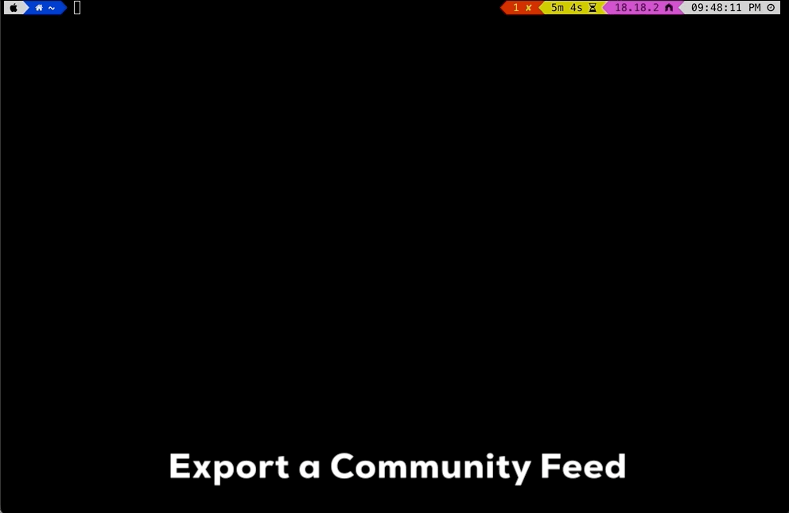
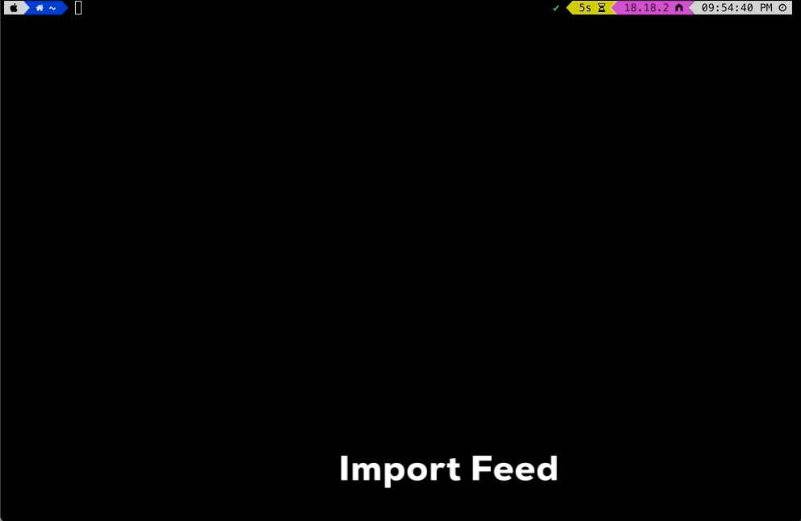

# Table Of Contents
- [Table Of Contents](#table-of-contents)
- [`stm` Event Feeds](#stm-event-feeds)
  - [Local vs Community (also referred to as Contributed) feeds](#local-vs-community-also-referred-to-as-contributed-feeds)
  - [AsyncAPI Feed](#asyncapi-feed)
- [`stm feed` tool Interactivity](#stm-feed-tool-interactivity)
- [`stm feed` Commands](#stm-feed-commands)
  - [Preview an Event Feed](#preview-an-event-feed)
  - [Generate an Event Feed](#generate-an-event-feed)
  - [Configure Data Generation Rules for an Event Feed](#configure-data-generation-rules-for-an-event-feed)
    - [Actions Available in the Send Topics Tab:](#actions-available-in-the-send-topics-tab)
  - [Run an Event Feed to stream events](#run-an-event-feed-to-stream-events)
  - [From Command-line](#from-command-line)
    - [Streaming via Command-line](#streaming-via-command-line)
    - [Streaming via UI](#streaming-via-ui)
  - [List Event Feeds](#list-event-feeds)
  - [Download \& Import an Event Feed](#download--import-an-event-feed)
    - [Download a Feed](#download-a-feed)
    - [Importing a Feed](#importing-a-feed)
  - [Export an Event Feed to Event Portal](#export-an-event-feed-to-event-portal)
  - [Contribute Event Feed to Community](#contribute-event-feed-to-community)

# `stm` Event Feeds

`stm` event feeds are configurations that represents an event streaming service built on an AsyncAPI document of an Event Portal Application or Event API. While any valid AsyncAPI document can be used, exceptions include unsupported cases or edge scenarios in JSON payload schema representation.

An AsyncAPI file downloaded from the Event Portal encapsulates the schema, events, and publish/subscribe settings as defined by the Application or Event API. Focusing on the publish settings, the ```stm feed``` extracts essential details to generate mock events, applying rules to produce schema-compliant data and stream it to a Solace PubSub+ broker.

To invoke feed commands of the `stm` tool, you issue a sub-command `feed` followed by desired operation.
```
stm
├── -v, --version                   /* output the version number                      */
├── -h, --help                      /* display help for command                       */
└── feed                            /* manage event feeds                             */
    ├── -h, --help                  /* display help for command                       */
    ├── preview                     /* Preview an AsyncAPI document                   */
    ├── generate                    /* Generate event feed from an AsyncAPI document  */
    ├── configure                   /* Configure event feed rules                     */
    ├── run                         /* Run event feed                                 */
    ├── list                        /* List event feeds                               */
    ├── import                      /* Import an event feed from archive file         */
    ├── export                      /* Export an event feed to Event Portal           */
    ├── archive                     /* Archive an event feed                          */
    └── contribute                  /* Contribute to community event feeds            */
```

> **A contributed (aka community feed) can be run directly from the  [Solace Event Feeds](https://feeds.solace.dev) site. Refer to the [Contribute & Run an Event Feed](#contribute-event-feed-to-community) section for more details.**

## Local vs Community (also referred to as Contributed) feeds

As you are building and testing an event feed using *stm*, you would create event feeds locally. You can configure feed rules, test and execute them by pointing to local or cloud brokers easily. These are referred to as *local event feeds*.

If the created feed has value in terms of domain-specialization or reuse by community members, you can contribute the feeds to be added to the community repository. These contributed feeds can be accessed by other members directly from the community site or cloned to create a copy for local use.


## AsyncAPI Feed

An event feed generated from an AsyncAPI document corresponding to an *Application* from *Event Portal* is referred to as AsyncAPI feed. This feed type allows you to operate on events that the application is permitted to publish and generate events. You can configure rules for event feed (including data generation, topic construction and publish settings). At runtime, you can simply point to a broker (local or cloud) and stream a series of events.

Now, let us examine the feed operations.

# `stm feed` tool Interactivity

All feed commands can be executed interactively, in a guided manner with the tool walking you through the steps, presenting appropriate queries and options. However, the commands also support a parameterized specification of values for options to execute the command. 

Here is an example of `preview` command that takes the options interactively on the command-line.

Interactive Mode| CLI Parameters
--|--
|

> Be sure to checkout the command-line options available for each command.
> 
# `stm feed` Commands

## Preview an Event Feed

The `preview` sub-command allows you to preview an AsyncAPI document to gain a quick visual of the Application/API details around send/receive events and details of schema referred by these events.

You can also preview an existing local or community feed.

```
 Usage: stm feed preview [options]

Preview an AsyncAPI document

Options:
  -file, --file-name <ASYNCAPI_FILE>      the asyncapi document
  -feed, --feed-name <FEED_NAME>          the feed name
  -type, --feed-type <FEED_TYPE>          the feed type (default: "asyncapi")
  -view, --feed-view <FEED_VIEW>               the feed view: publisher, provider;
                                              generates feed for subscribe operations and vice versa (default:
                                          "publisher")
  -community, --community-feed [BOOLEAN]  a community feed (default: false)

  /* HELP OPTIONS */
  -h, --help                              display help for command
```

AsyncAPI Document| Local Feed | Community Feed
--|--|--
|||

## Generate an Event Feed

The `generate` sub-command creates an event feed from an AsyncAPI document with the following steps:

- Validation: Verifies the provided AsyncAPI document and aborts if invalid.
- Feed Description: Prompts for attributes like feed name, description, contributor details, feed domain, and identifying tags (name, domain, and tags are mandatory).
- Conflict Handling: If a feed with the specified name exists, it provides the option to overwrite or skip the process.


```
Usage: stm feed generate [options]

Generate event feed from an AsyncAPI document

Options:
  -file, --file-name <ASYNCAPI_FILE>  the asyncapi document
  -feed, --feed-name <FEED_NAME>      the feed name
  -type, --feed-type <FEED_TYPE>      the feed type (default: "asyncapi")
  -view, --feed-view <VIEW>           the feed view: publisher, provider;
                                          generates feed for subscribe operations and vice versa (default: "publisher")

  /* HELP OPTIONS */
  -h, --help                          display help for command
```

The generated feed is stored in the `$HOME/.stm/feeds` directory (`%HOME%\.stm\feeds` on Windows) with the folder name matching the specified feed name.

> If you’ve set a custom path for the `STM_HOME` environment variable, the feeds directory will be located under that custom path.

You can verify the generated feed with the `stm feed preview` -> `Local Event Feeds` -> ``<specified-feed-name>`` option.

Generate a Feed| Validate the Feed
--|--
||

## Configure Data Generation Rules for an Event Feed

The `configure` sub-command enables setting up data generation rules for *topic* and *payload* parameters. It also allows optional mapping of attributes (e.g., `topic parameter → payload attribute, payload attribute → another attribute`).

To learn about supported data generation rules, refer to the documentation: [Data Generation Rules](./DATAGENERATION_RULES.md)

An Event Feed configuration exposes feed operations — send and receive events and their schemas. Under the *Messages* group, you can explore all exposed `messages` (events). Selecting a message reveals its details, including `name, schema`, and the `topics` it uses for send and receive operations.

> NOTE: Event Feed primarily focuses on `send` operations, exposing related details (topics, parameters, and payload). When using the `-view / --feed-view` option of the `generate` sub-command with the provider setting, the messages displayed correspond to the `receive` operations in the AsyncAPI document.

### Actions Available in the Send Topics Tab:
- **Select Topic**: Choose from multiple topics associated with a message.
- **Configure Topic Parameter Rules**: Define data generation rules for topic parameters (if present).
>*NOTE:* All topic parameters are treated as `string` data types
- **Configure Payload Rules**: 
  - Set data generation rules for basic data types.
  - Drill down to configure rules for Object attributes.
  - Specify the number of instances for Array attributes.
- **Supported Data Types:** Arrays, Objects, and nested Arrays or Objects (e.g., Array<?>), where **?** can be a *basic type, object,* or another *array*.
- **Mapping of Attributes:** Define mappings between payload and topic attributes based on use case. These mappings are applied to generated data at runtime. Supported mappings include:
  - Payload attribute → Topic parameter
  - Payload attribute → Another payload attribute
  - Topic parameter → Payload attribute
>*NOTE:* Mismatched attribute types are blocked by a data type compatibility check.
- **Session Settings:** Configure session settings:
  - Settings to manage session connect, reconnect, retry attempts, keep-alive and timeout parameters
  - Flags to generate additional information: senderId, send and receive timestamps and sequence number
  - Client settings for client name, application description
- **Message Settings:** Configure message settings:
  - Settings to manage message properties: payload type, app message type & id, delivery mode, correlation key, dmq & eliding eligibility, ttl, user-properties
  - Partition key settings
- **Publish Settings:** Configure runtime settings for streaming events:
  - Number of events to publish (default is 0 for continuous streaming).
  - Interval between publish operations (in milliseconds).
  - Initial delay (in milliseconds) for a delayed start of the streaming activity.

Step| Video
--|--
Launch Feed Config||
List Available Feeds & Choose the feed||
Configure Data Generation Rules - 1||
Configure Data Generation Rules - 2||
Configure Data Generation Rules - 3 & Review/Configure Topic Parameters||
Define Attribute Mapping||
Review Sample Data - 3||

## Run an Event Feed to stream events

The `run` sub-command executes an event feed, allowing you to stream events either from the command line or through a UI.

What does "run" an event feed mean? It refers to the process of streaming events from the feed, with the payload and topic parameters populated with meaningful data based on the configured data generation rules.

## From Command-line

The `stm feed run` command provides an interactive way to:

- Select a feed.
- Choose one or more events from the feed.
- Stream the generated events to a Solace PubSub+ broker.
  
You can specify the target broker using the `--config <CONFIG_NAME>` option. If not provided, events are streamed to the local (default) broker.

For details on creating broker configurations for `stm`, see the "Setup stm Configuration" section of the `stm` documentation.

Below is a preview of additional command-line parameters supported by the `stm feed run` command.

```
Usage: stm feed run [options]

Run event feed

Options:
  -ui, --ui-portal [BOOLEAN]                launch feeds portal (default: false)
  -feed, --feed-name <FEED_NAME>            the feed name
  -events, --event-names <EVENT_NAME...>    the event name(s) as space-separated values if listing more than one (e.g., "Loan_Applied" "Loan_Approved" )
  -community, --community-feed [BOOLEAN]    a community feed (default: false)
  -c, --config <CONFIG_FILE>                the configuration file (default: "stm-cli-config.json")

  /* MESSAGE SETTINGS */
  --count <COUNT>                           the number of events to publish (default: 1)
  --interval <MILLISECONDS>                 the time to wait between publish (default: 3000)
  --initial-delay <MILLISECONDS>            the time to wait before starting the event publish (default: 0)

  /* MESSAGE OUTPUT SETTINGS */
  --output-mode <MODE>                      [advanced] message print mode: DEFAULT, PROPS OR FULL (default: "DEFAULT")

  /* HELP OPTIONS */
  -hm, --help-more                          display more help for command with options not shown in basic help
  -h, --help                                display help for command
  ```
  
  ### Streaming via Command-line

Step| Video
--|--
Launch CLI & Start Streaming||


### Streaming via UI

  Step| Video
--|--
Launch Feed UI||
Select a Feed||
Start Streaming||

## List Event Feeds

The `list` sub-command displays a list of both local and community event feeds available in your environment. It provides an overview of the feeds, making it easy to view, manage, and navigate through the available configurations. This command helps quickly identify the feeds you have access to, whether they are created locally or shared by the community.

>NOTE: The flag `-v, --verbose` option displays feed details (brief)

```
Usage: stm feed list [options]

List event feeds

Options:
  -local, --local-only [BOOLEAN]          list local event feeds (default: true)
  -community, --community-only [BOOLEAN]  list community event feeds (default: true)
  -v, --verbose [BOOLEAN]                 list feed details (default: false)

  /* HELP OPTIONS */
  -h, --help                              display help for command
```
Step| Video
--|--
List Feeds (Simple)||
List Feeds (Verbos)|

## Download & Import an Event Feed

Download and import commands for event feeds provide critical functionality for managing and sharing configurations effectively. The download command allows you to package an event feed's settings, rules, and mappings into a portable format. This is particularly useful for backup, version control, or sharing feeds across teams and environments.

The import command enables seamless integration of exported feeds into another `stm` setup, and avoids the need to recreate feeds manually. Together, these commands simplify collaboration, improve portability, and ensure consistency across development, testing, and production environments.

### Download a Feed

The `download` sub-command creates an archive (ZIP) file of an event feed, making it easy to store and share with team members. This feature saves time and effort by preserving the feed configuration and data generation rules, eliminating the need to recreate them manually. Both local and community feeds can be downloaded.

The resulting archive is named `feed-archive.zip` and is ready for distribution or backup.

```
Usage: stm feed download [options]

Download an event feed

Options:
  -feed, --feed-name <FEED_NAME>           the community feed name
  -community, --community-only [BOOLEAN]   list community event feeds (default: false)
  -archive, --archive-file <ARCHIVE_NAME>  the feed archive name

  /* HELP OPTIONS */
  -h, --help                               display help for command
```

Step| Video
--|--
Download a Community Feed|


### Importing a Feed

The `import` sub-command allows you to integrate an event feed from a downloaded archive (ZIP file) into your environment (local stm setup). This simplifies collaboration and ensures consistency by avoiding the need to manually recreate feed configurations and data generation rules.

```
Usage: stm feed import [options]

Import an event feed

Options:
  -archive, --archive-file <ARCHIVE_NAME>  the feed archive name (default: "feed-archive.zip")

  /* HELP OPTIONS */
  -h, --help                               display help for command
```

Step| Video
--|--
Import a Feed from a Downloaded Archive File||

## Export an Event Feed to Event Portal

The `export` sub-command displays a list of both local and community event feeds available in your environment. Once a feed is selected, this command will guide you through the steps to export the application to Event Portal.

```
Usage: stm feed export [options]

List event feeds

Options:
  -local, --local-only [BOOLEAN]          list local event feeds (default: true)
  -community, --community-only [BOOLEAN]  list community event feeds (default: true)
  -logs, --show-logs [BOOLEAN]            show export log (default: false)

  /* HELP OPTIONS */
  -h, --help                              display help for command
```
Step| Video
--|--
Export Feed|


## Contribute Event Feed to Community

Locally created event feeds can be contributed for community use, allowing you to share your configurations, data generation rules, and event structures with others. By contributing to the community, you help build a collaborative environment where others can benefit from your work, streamline their own setups, and enhance overall knowledge sharing. This fosters a collective approach to improving event-driven architectures and accelerates development across teams and organizations.

```
Usage: stm feed contribute [options]

Contribute to community event feeds

Options:
  -feed, --feed-name <FEED_NAME>  the feed name

  /* HELP OPTIONS */
  -h, --help                      display help for command
```

The `contribute` command enables you to share a local event feed with the community by submitting it to the community feeds site. Contributions undergo a review and approval process managed by community feed maintainers. Any updates, including requests for changes or confirmation of acceptance/rejection, will be communicated via the email specified during the contribution process.

> NOTE: The provided email is used solely for communication during the approval process and will not be stored or made public.

Contribution Process:
- Select a local event feed from the list.
- Optionally modify the feed description.
- Specify a domain that best categorizes the feed.
- Add keywords describing the feed's scope and purpose.
- Provide an image URL or base64 image data for the feed icon.
- Include contributor details (name, Git handle).
- Provide a valid email for communication.
- Add any additional information to accompany the pull request created for the contribution.

An approved event feed will be listed on the [community feeds site](https://feeds.solace.dev) with due attribution.

By contributing, you share valuable configurations with the community and foster collaboration while receiving attribution for your efforts.

Step| Video
--|--
Contribute Feed||
PR for Review||
Run Feed from Community Feed Portal||
